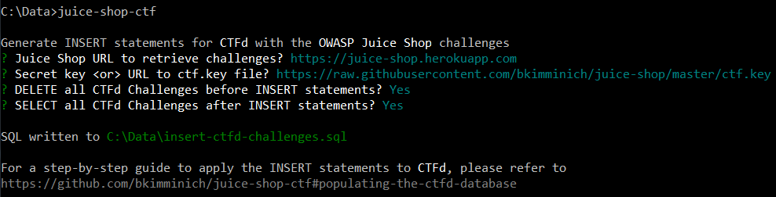

#  OWASP Juice Shop CTF [](https://www.owasp.org/index.php/OWASP_Project_Inventory#tab=Incubator_Projects) [](https://github.com/bkimminich/juice-shop-ctf/releases/latest) [](https://twitter.com/owasp_juiceshop)

[](https://travis-ci.org/bkimminich/juice-shop-ctf)
[](https://coveralls.io/github/bkimminich/juice-shop-ctf?branch=master)
[](https://codeclimate.com/github/bkimminich/juice-shop-ctf)
[](https://www.bithound.io/github/bkimminich/juice-shop-ctf)
[](https://gemnasium.com/github.com/bkimminich/juice-shop-ctf)

The NPM package
[`juice-shop-ctf-cli`](https://www.npmjs.com/package/juice-shop-ctf-cli)
lets you create a list of `INSERT` statements for the
[CTFd](https://ctfd.io) database that will populate the platform for a
[Capture the Flag](https://en.wikipedia.org/wiki/Capture_the_flag#Computer_security)
event using
[OWASP Juice Shop](https://www.owasp.org/index.php/OWASP_Juice_Shop_Project).



## Installation [](https://www.npmjs.com/package/juice-shop-ctf-cli) [](https://www.npmjs.com/package/juice-shop-ctf-cli)

```
npm i -g juice-shop-ctf-cli
```

## Usage

Open a command line and run:

```
juice-shop-ctf
```

Then simply follow the instructions of the command line tool.

### Populating the [CTFd](https://ctfd.io) database

Apply the generated `insert-ctfd-challenges.sql` following the steps
describing your own CTFd setup.

#### Default setup (including SQLite database)

1. Get CTFd with `git clone https://github.com/CTFd/CTFd.git`.
2. Perform steps 1 and 3 from
   [the CTFd installation instructions](https://github.com/CTFd/CTFd#install).
3. Use your favourite SQLite client to connect to the CTFd database and
   execute the `INSERT` statements you created.
4. Browse to your CTFd instance UI (by default <http://127.0.0.1:4000>)
   and create an admin user and CTF name

#### `docker-compose` setup (including MySQL container)

1. Setup
   [Docker host and Docker compose](https://docs.docker.com/compose/install/).
2. Follow steps 2-4 from
   [the CTFd Docker setup](https://github.com/isislab/CTFd/wiki/Deployment#docker)
   to download the source code, create containers and start them.
3. After running `docker-compose up` from previous step, you should be
   able to browse to your CTFd instance UI (`<<docker host IP>>:8000` by
   default) and create an admin user and CTF name.
4. Once you have done this, run `docker-compose down` or use `Ctrl-C` to
   shut down CTFd. Note: Unlike a usual Docker container, data will
   persist even afterwards.
5. Add the following section to the `docker-compose.yml` file and then
   run `docker-compose up` again:

   ```
   ports:
     - "3306:3306"
   ```

6. Use your favourite MySQL client to connect to the CTFd database
   (default credentials are root with no password) and execute the
   `INSERT` statements you created.
7. Browse back to your CTFd instance UI and check everything has worked
   correctly.
8. If everything has worked, do another `docker-compose down`, remove
   the ports section you added to `docker-compose.yml` and then do
   `docker-compose up` again and you are ready to go!

#### Other setups (PostgreSQL or MySQL)

1. Perform any of
   [the CTFd database setups](https://github.com/isislab/CTFd/wiki/SQL-Server-Setup)
2. Launch your CTFd instance and perform the remaining setup similar to
   [the SQLite default setup](#default-setup-including-sqlite-database).

## Troubleshooting [](https://gitter.im/bkimminich/juice-shop)

> If you need help with the application setup please check the
> Troubleshooting section below or post your specific problem or
> question in the
> [official Gitter Chat](https://gitter.im/bkimminich/juice-shop).

- If using Docker Toolbox on Windows make sure that you also enable port
  forwarding for all required ports from Host `127.0.0.1:XXXX` to
  `0.0.0.0:XXXX` for TCP in the `default` VM's network adapter in
  VirtualBox. For CTFd you need ports `8000` permanantly and `3306`
  during setup.

## Contributing [](https://github.com/bkimminich/juice-shop-ctf/graphs/contributors) [](https://huboard.com/bkimminich/juice-shop-ctf)

Found a bug? Got an idea for enhancement? Improvement for cheating
prevention?

Feel free to
[create an issue](https://github.com/bkimminich/juice-shop-ctf/issues)
or
[post your ideas in the chat](https://gitter.im/bkimminich/juice-shop)!
Pull requests are also highly welcome - please refer to
[CONTRIBUTING.md](CONTRIBUTING.md) for details.

## Donations

### PayPal [](https://www.paypal.com/cgi-bin/webscr?cmd=_donations&business=paypal%40owasp%2eorg&lc=BM&item_name=OWASP%20Juice%20Shop&item_number=OWASP%20Foundation&no_note=0&currency_code=USD&bn=PP%2dDonationsBF)

PayPal donations via above button go to the OWASP Foundations and are
earmarked for "Juice Shop". This is the preferred way to support the
project.

### Others

[](https://flattr.com/thing/3856930/bkimminichjuice-shop-on-GitHub)
[](https://gratipay.com/juice-shop)

[](https://blockchain.info/address/1AbKfgvw9psQ41NbLi8kufDQTezwG8DRZm)
[](https://explorer.dash.org/address/Xr556RzuwX6hg5EGpkybbv5RanJoZN17kW)
[](https://etherscan.io/address/0x0f933ab9fcaaa782d0279c300d73750e1311eae6)

## Contributors

Ordered by date of first contribution.
[Auto-generated](https://github.com/dtrejo/node-authors) on Wed, 01 Feb
2017 20:01:35 GMT.

- [Björn Kimminich](https://github.com/bkimminich) aka `bkimminich`
- [Josh Grossman](https://github.com/tghosth) aka `tghosth`

## Licensing [](LICENSE)

This program is free software: you can redistribute it and/or modify it
under the terms of the [MIT license](LICENSE). OWASP Juice Shop and any
contributions are Copyright © by Bjoern Kimminich 2016-2017.


